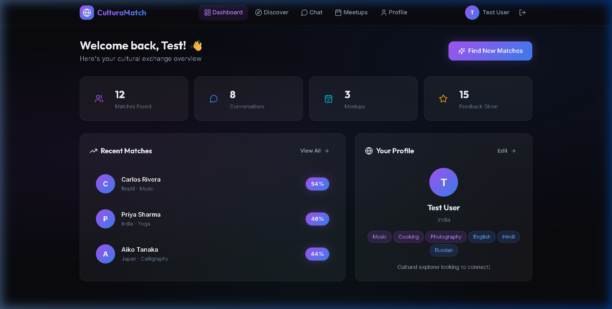
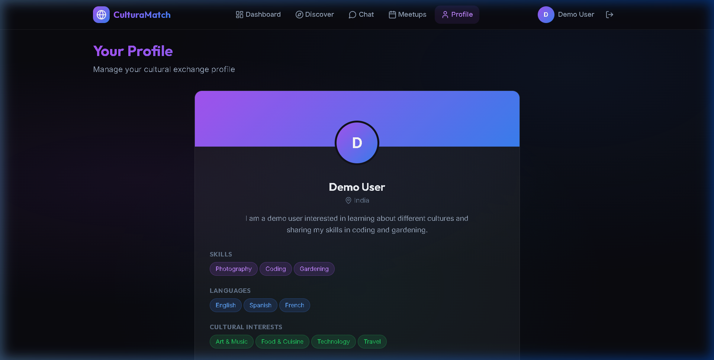

<div align="center">

# ⚡ DevMatch

### *Find Your Perfect Hackathon Team — In Seconds*

[](LICENSE)
[](https://react.dev/)
[](https://nodejs.org/)
[](https://python.org/)
[](https://vitejs.dev/)
[](/)

**DevMatch** is an AI-powered developer matching platform that forms the perfect hackathon team by intelligently pairing developers based on their **skills, roles, and collaboration style** — using Fuzzy Logic and a Neural Network trained on real team compatibility data.

> 🏆 Built in 24 hours · Fully functional · Live demo ready

<br>


</div>

---

## 🚨 Problem Statement

> **"Finding the right teammates for a hackathon is the #1 barrier to participation."**

Every hackathon, developers either:
- Team up randomly and suffer skill gaps (all 5 members know React, nobody knows ML)
- Spend the first 2–3 hours just finding teammates — **wasting critical build time**
- Fly solo, limiting their project scope and reducing chances of winning

There is **no smart system** that matches developers by complementary skills, preferred role, and experience level before a hackathon begins.

**DevMatch solves this.**

---

## 🎯 Objective

Build an intelligent, developer-first platform that:

1. **Collects structured dev profiles** (skills, role, experience level, hackathon goals)
2. **Runs AI-based matching** to find the most complementary teammates
3. **Enables real-time communication** so teams can form, communicate, and plan — all in one place
4. **Scales** from a single college hackathon to a global platform

---

## ✨ Features

### 🔵 MVP Features *(Core, Demo-Ready)*

| Feature | Description |
|--------|-------------|
| 🧑‍💻 **Developer Profile** | Create a profile with your tech stack, preferred role (Frontend / Backend / ML / Design / DevOps), and experience level |
| 🤖 **AI-Powered Matching** | Fuzzy Logic + Neural Network engine scores compatibility across skill overlap, role balance, and experience fit |
| 🔍 **Discover Page** | Browse AI-ranked match cards showing each developer's skills, role, and compatibility score |
| 📊 **Dashboard** | Real-time stats: matches found, connections made, active conversations |
| 🔐 **Auth System** | Secure JWT-based registration and login with bcrypt password hashing |

### 🟣 Advanced / Bonus Features *(Already Implemented)*

| Feature | Description |
|--------|-------------|
| 💬 **Real-Time Chat** | Message your matches instantly, plan your project before the hackathon begins |
| 📅 **Team Meetups** | Schedule virtual sync-ups to align on project ideas, divide tasks, and set goals |
| 🧠 **Adaptive AI** | Neural network continuously learns from user feedback to improve match quality over time |
| 📈 **Feedback Loop** | Rate your matches to train the model — the platform gets smarter with every interaction |
| 🌐 **Scalable Architecture** | Microservices-ready three-tier design (Frontend → REST API → AI Engine) |

---

## 👤 User Flow

```
1. REGISTER  →  Enter name, email & password
                   ↓
2. BUILD PROFILE  →  Select your tech stack (React, Python, ML, etc.)
                     Choose your role: Frontend | Backend | ML | Design | DevOps
                     Pick your experience level: Beginner | Intermediate | Expert
                     ↓
3. GET MATCHED  →  AI engine runs Fuzzy Logic + Neural Network scoring
                   Returns top developer matches ranked by compatibility %
                   ↓
4. CONNECT  →  View match cards → open Chat → introduce yourself
                ↓
5. FORM TEAM  →  Schedule a Meetup → align on idea → register for the hackathon together
```

---

## 🏗️ System Design

```
┌─────────────────────┐      ┌──────────────────────┐      ┌──────────────────────────┐
│   React + Vite      │─────▶│  Node.js + Express   │─────▶│   Python Flask           │
│   Frontend UI       │ REST │  REST API Backend     │ REST │   AI Matching Engine     │
│   (port 5173)       │      │  (port 5000)          │      │   (port 5001)            │
└─────────────────────┘      └──────────────────────┘      └──────────────────────────┘
         │                            │                               │
         │                            ▼                               ▼
         │                    JSON File Storage              ┌─────────────────────┐
         │                    (users, chats,                 │  Fuzzy Logic Engine │
         │                     meetups, feedback)            │  + Neural Network   │
         │                                                   │  (4 → 8 → 1 layers)│
         └──────────── Dark Glassmorphism UI ────────────────└─────────────────────┘
```

**Why this design?**
- **Decoupled AI Service** — swap or upgrade the matching model without touching the app
- **Stateless REST API** — horizontally scalable, JWT-secured
- **Zero-config storage** — JSON file storage for rapid demo; swap to MongoDB/PostgreSQL for production
- **React SPA** — fast, component-based, mobile-responsive UI

---

## 🧠 AI Matching Engine (The Core Innovation)

The heart of DevMatch is a **two-stage AI pipeline** designed specifically for developer compatibility scoring:

| Stage | Method | What It Measures |
|-------|--------|-----------------|
| **Stage 1 — Fuzzy Logic** | Triangular & Trapezoidal Membership Functions | Skill overlap, role complementarity, experience alignment |
| **Stage 2 — Neural Network** | Feedforward Net (4 → 8 → 1) | Learns from user feedback to personalize match quality |
| **Final Score** | Weighted Ensemble | 60% Fuzzy Logic + 40% Neural Network = trust-worthy match % |

### Why Fuzzy Logic?
Unlike binary matching (you either know React or you don't), Fuzzy Logic captures **degrees of skill**. A developer who "kind of knows" backend is still a partial match — and DevMatch scores that correctly.

### Why a Neural Network?
User feedback trains the model. If users keep rejecting certain match patterns, the network learns to deprioritize them. **The platform gets smarter with every hackathon.**

---

## 📸 Screenshots

### Landing Page
<div align="center">

</div>

---

### Developer Profile Onboarding (3-Step Flow)
<div align="center">
<table>
  <tr>
    <td align="center"><strong>Step 1 — Personal Details</strong></td>
    <td align="center"><strong>Step 2 — Skills & Role</strong></td>
  </tr>
  <tr>
    <td></td>
    <td></td>
  </tr>
</table>
</div>

---

### Dashboard
<div align="center">

</div>

---

### AI-Powered Discover Page
<div align="center">

</div>

---

### Real-Time Chat
<div align="center">

</div>

---

### Developer Profile
<div align="center">

</div>

---

### Team Meetup Scheduler
<div align="center">

</div>

---

## 🛠️ Tech Stack

### Frontend
- **React 18** — Fast, declarative component-based UI
- **Vite 6** — Lightning-fast build tool and dev server
- **React Router** — Client-side routing with protected routes
- **Lucide React** — Clean developer-focused icon set
- **CSS3** — Custom dark glassmorphism design system with micro-animations
- **Google Fonts** — Inter & Outfit for a modern developer aesthetic

### Backend
- **Node.js** — High-performance JS runtime
- **Express.js** — RESTful API with clean middleware architecture
- **JWT** — Stateless, secure authentication
- **bcrypt** — Industry-standard password hashing
- **CORS** — Configured cross-origin resource sharing

### AI Service
- **Python 3.9+** — AI/ML service language
- **Flask** — Lightweight REST microservice framework
- **NumPy** — Efficient numerical computation
- **Fuzzy Logic** — Custom triangular & trapezoidal membership functions
- **Neural Network** — Hand-implemented feedforward net (no heavy ML framework needed)

---

## 🚀 Getting Started

### Prerequisites
- Node.js 18+
- Python 3.9+
- npm / pip

### Step 1: Clone & Install

```bash
git clone https://github.com/adi4sure/DevMatch.git
cd DevMatch

# Install frontend dependencies
cd frontend && npm install

# Install backend dependencies
cd ../backend && npm install

# Install AI service dependencies
cd ../ai-service && pip install -r requirements.txt
```

### Step 2: Run the Application

Open **3 terminals**:

```bash
# Terminal 1 — Backend API (port 5000)
cd backend && npm run dev

# Terminal 2 — Frontend (port 5173)
cd frontend && npm run dev

# Terminal 3 — AI Matching Engine (port 5001)
cd ai-service && python app.py
```

### Step 3: Open in Browser

```
http://localhost:5173
```

### Step 4: Create Your Dev Profile

1. Click **"Get Started"** on the landing page
2. **Step 1** — Enter your name, email, and password
3. **Step 2** — Select your tech skills and preferred role (Frontend / Backend / ML / Design / DevOps)
4. **Step 3** — Set your experience level and write a short bio about what you want to build
5. Click **"Create Account"**

### Step 5: Discover & Connect

- Go to **Discover** → See your AI-ranked developer matches with compatibility scores
- Open **Chat** → Message a match and align on a project idea
- Visit **Meetups** → Schedule a quick sync before the hackathon starts

---

## 👥 Demo Seed Data

The platform comes pre-seeded with **6 developer profiles** for instant demo:

| Name | Role | Skills | Experience |
|------|------|--------|------------|
| 🧑‍🎨 Aiko T. | Frontend | React, Figma, CSS, Tailwind | Intermediate |
| 🧑‍💻 Carlos R. | Full Stack | Node.js, MongoDB, React, GraphQL | Expert |
| 👩‍🔬 Priya S. | ML Engineer | Python, TensorFlow, Scikit-learn, NLP | Intermediate |
| 🧑‍🔧 Emma M. | DevOps | Docker, Kubernetes, CI/CD, AWS | Expert |
| 👩‍💻 Fatima H. | Backend | Django, PostgreSQL, REST APIs, Redis | Intermediate |
| 🧑‍🎤 Yuki P. | Mobile Dev | Flutter, Firebase, React Native | Beginner |

---

## 📁 Project Structure

```
DevMatch/
├── frontend/                 # React + Vite SPA
│   ├── src/
│   │   ├── pages/            # Landing, Dashboard, Discover, Chat, Profile, Meetups
│   │   ├── App.jsx           # Routing + auth context
│   │   └── index.css         # Design system (dark glassmorphism)
│   └── index.html
├── backend/                  # Node.js + Express REST API
│   ├── server.js             # API routes, auth middleware
│   └── data/                 # JSON file storage (users, chats, meetups)
├── ai-service/               # Python Flask AI microservice
│   ├── app.py                # Fuzzy logic + neural network matching engine
│   └── requirements.txt
├── screenshots/              # UI screenshots for documentation
└── README.md
```

---

## 📈 Scalability & Future Roadmap

| Phase | Feature |
|-------|---------|
| **Phase 1 (Now)** | AI matching, profiles, chat, meetups — fully working MVP |
| **Phase 2** | MongoDB/PostgreSQL migration, WebSocket real-time chat |
| **Phase 3** | GitHub integration (auto-populate skills from repos) |
| **Phase 4** | Hackathon organizer portal — send team invites, form groups officially |
| **Phase 5** | Mobile app (React Native) + global hackathon calendar integration |

---

## 💡 Why DevMatch Wins

- ✅ **Real problem** — every developer attending a hackathon has experienced this
- ✅ **Working AI** — not a mock; the fuzzy + neural pipeline actually scores matches
- ✅ **Full-stack** — frontend + backend + AI service, all integrated and running
- ✅ **Clean UX** — dark glassmorphism design, smooth animations, mobile-aware layout
- ✅ **Demo-ready** — seed data, 3-step onboarding, instant match results
- ✅ **Scalable design** — microservice architecture, stateless API, decoupled AI engine

---

## 📄 License

MIT License — see [LICENSE](LICENSE) for details.

---

<div align="center">

**⚡ DevMatch — Build better teams. Build better products.**

*Made with 💻 for every developer who's ever scrambled to find a teammate at 11:59 PM*

<br>

**Developer:** Aditya Raj Chourassia

</div>